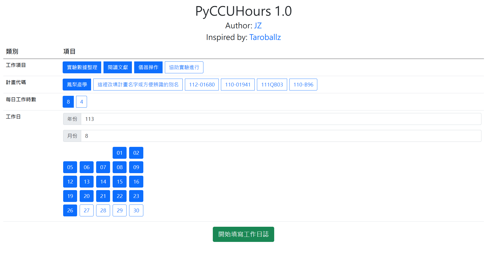
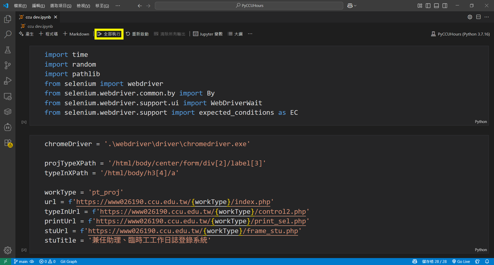

# PyCCUHours

自動填寫中正大學兼任助理工讀單的工具，啟發自 [TaroballzChen](https://github.com/TaroballzChen) 的 [GoCCUHours](https://github.com/TaroballzChen/GoCCUHours) 專案。



# 安裝
1. [按我下載此程式](https://github.com/JzzzHung/PyCCUHours/releases/download/v1.0/PyCCUHours.zip)
2. 在終端機執行以下命令
```bash
conda create --name PyCCUHours python=3.7 -y
conda activate PyCCUHours
conda install -y ipykernel requests selenium
```

# 使用方法
## 使用自動化程式
1. 更新 `chromedriver`。（開發細節參照作者另一專案 [chromedriver-downloader](https://github.com/JzzzHung/chromedriver-downloader)）
   1. Windows 用戶：到 `webdriver` 資料夾執行 `RUN.bat`。
   2. macOS 用戶：在終端機執行：
        ```bash
        conda activate PyCCUHours
        python webdriver/main.py
        ```
2. 開啟 `ccu dev.ipynb` 後，按下`全部執行`。
3. 隨後跳出參數填寫頁面，填完按下`開始填寫工作日誌`.
4. 等自動化程式跑完會自動結束。
   1. 如有 `chromedriver` 版本問題，請回到步驟1重新操作。

## 新增選項
1. 在 `index.html` 內按照註解說明可新增工作項目、計畫代碼、工作時數的選項

# 更新
* 2022/01：第一版上線
* 2024/08：最後一次維護
